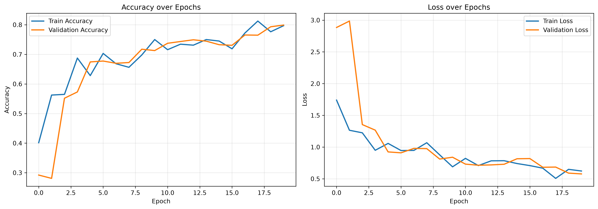
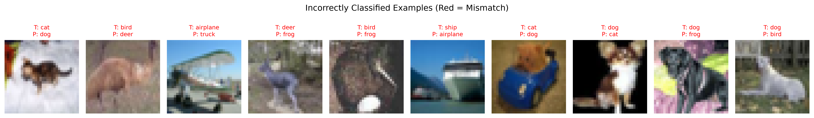

# CIFAR-10 Image Classification using CNN

A deep learning image classification project built using TensorFlow and Keras.

## Overview

This project trains a Convolutional Neural Network (CNN) on the CIFAR-10 dataset to classify images into 10 categories:

- Airplane
- Automobile
- Bird
- Cat
- Deer
- Dog
- Frog
- Horse
- Ship
- Truck

---

## Model Architecture

- Conv2D Layers
- Batch Normalization
- Max Pooling
- Dropout Regularization
- Dense Layers
- Softmax Output

---

## Training Features

- Data Augmentation
- Early Stopping
- Learning Rate Scheduling
- Validation Monitoring

---

## Results

| Metric | Value |
|----------|----------|
| Test Accuracy | 79.09% |
| Macro F1 Score | 79.02% |
| Weighted F1 Score | 79.02% |

---

## Training Curves

---

## Confusion Matrix

---

## Sample Predictions

---

## Tech Stack

- Python
- TensorFlow
- Keras
- NumPy
- Matplotlib
- Scikit-Learn

---

## Future Improvements

- ResNet Architecture
- Transfer Learning
- Hyperparameter Tuning
- Larger Data Augmentation Pipeline
